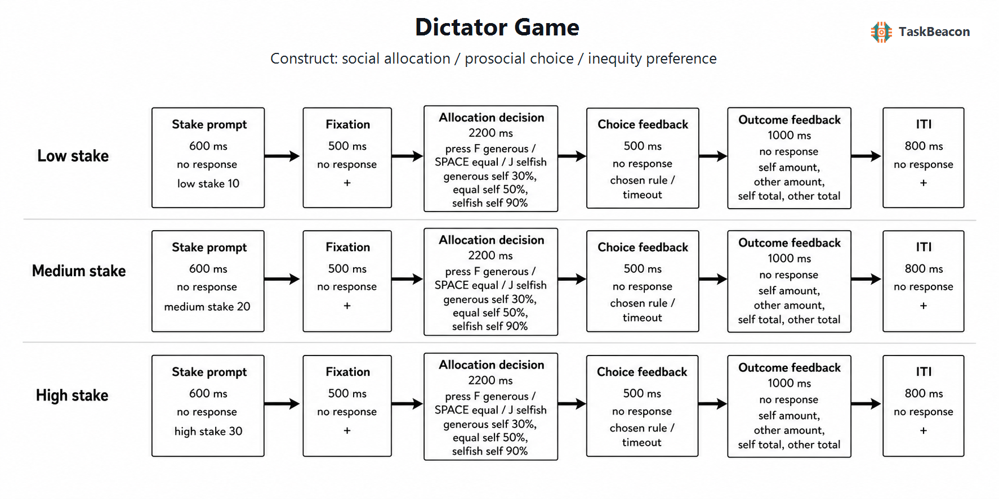

# 独裁者博弈：非策略性资源分配、社会规范与利他选择的实验研究

独裁者博弈（Dictator Game, DG）旨在回答一个基础而严格限定的问题：当个体能够单方面决定自身与他人的资源结果，且无需承担被拒绝或被报复的策略风险时，是否仍会牺牲自身收益。该范式删除了最后通牒博弈中的受益者否决权，使分配行为主要反映无条件的他人关切及其情境调节，而不再混入对拒绝的预期（Forsythe et al., 1994; Thielmann et al., 2021）。这一操作简化带来了较高的实验可控性，也形成了核心解释难题：同一次给予既可能源于利他、平等偏好或规范遵从，也可能受实验者需求、声誉顾虑、产权感和选项设置影响。因而，DG 是社会偏好的行为测量范式，而不是对稳定“利他人格”的直接检验。

## 1. 范式提出与理论背景

DG 的思想起点可追溯至 Kahneman、Knetsch 与 Thaler（1986）关于公平判断的实验：匿名决策者在不平等且自利的分配与平等分配之间作出选择，结果显示物质收益最大化不足以解释全部行为。Forsythe 等人（1994）随后将单方分配与最后通牒博弈置于有无真实报酬的设计中比较，确立了当代 DG 的基本结构，并说明公平偏好不能单独解释两类博弈之间的差异。标准 DG 中，分配者拥有禀赋 *e*，向无决策权的受益者转移 *g*（取值范围为 0 至 *e*），最终收益分别为 *e − g* 与 *g*。若仅把实验货币视为效用，自利最优解为零转移；任何正转移均表明物质自利模型遗漏了他人结果、规范或社会评价等效用来源。

早期方法学研究很快表明，给予比例并非脱离程序而存在的纯偏好参数。双盲程序与“通过表现取得分配权”均提高了自利选择，但没有使给予完全消失（Hoffman et al., 1994）。允许分配者从受益者既有资金中拿取，会显著改变甚至反转标准给予模式（Bardsley, 2008; List, 2007）；当行动—结果关系可以保持模糊时，部分参与者利用“道德回旋余地”选择更有利于自身的结果（Dana et al., 2007）。这些发展把研究重点由“人是否利他”推进到“何种行动集、产权与信息结构允许何种社会动机表达”。Krupka 与 Weber（2013）进一步通过激励相容的协调任务测量禁令性规范，证明不同 DG 版本中的给予变化可由金钱收益与行为适当性共同预测。

## 2. 任务逻辑、流程与核心指标

标准单次 DG 依次包含角色和禀赋说明、分配选项呈现、分配者选择及结果兑现。受益者不作反应，分配决定通常不提供正确与错误反馈；反馈若存在，只呈现两人的实际所得。关键操控包括禀赋来源（意外所得或劳动所得）、行动集（仅给予或允许拿取）、选择形式（连续金额或离散方案）、匿名程度、受益者身份与社会距离、转移价格以及决定是否真实兑现。重复试次版本可系统改变自他收益组合并估计社会效用权重，但连续重复、累计反馈与固定伙伴也可能引入学习、一致性需求或隐含互动预期。

主要行为因变量是转移额 (g)、转移比例 (g/e)、零给予和平分选择的频率，以及在多方案设计中的选择概率和反应时。`给予 > 0` 说明个体没有实现自身货币收益最大化，但不足以区分利他与规范遵从；`平分 > 自利分配` 更直接涉及有利不平等厌恶，却仍受平分焦点和选项显著性影响；改变自他收益的边际交换率后，选择对“自身成本”和“他人收益”的敏感度才可用于估计相对价值权重（Hutcherson et al., 2015）。禀赋数额对绝对给予和给予比例的影响也应分别报告，因为较大金额可能增加绝对转移而降低相对转移。

构念识别取决于比较是否改变了目标属性。相同禀赋下比较平等与自利选项，混合了他人收益增加、自身收益减少和不平等程度下降；只有通过多组正交变化的自他收益组合，才能分别估计自身成本、他人收益与不平等厌恶。决策阶段的选择和反应时对应价值比较及冲突解决；标准 DG 的结果阶段不包含受益者反应，因而不能解释为互惠或社会反馈学习。若向参与者连续呈现累计收益，结果阶段还会引入预算显著性和先前选择信息，需要在试次水平模型中控制金额、序列与历史选择。

## 3. 主要行为与神经科学发现

### 3.1 给予分布及其情境依赖性

Engel（2011）汇总数百个 DG 条件后发现，分配者平均转移约 28% 的禀赋，零给予与平分均形成明显聚集点。该群体规律反驳了所有人均选择 (g=0) 的强预测，却不意味着每名参与者具有同质的利他效用。给予会随受益者可识别性、社会距离、禀赋来源、行动集与实验程序变化；因此，同一平均比例可能由完全自利、平等偏好和高额给予等不同潜在类型混合产生（Engel, 2011; Thielmann et al., 2021）。

金额效应同样依赖指标定义。绝对转移额、转移比例和自他收益差对禀赋增加可能呈现不同方向，离散选项还会把连续偏好压缩为类别转换。因而，比较不同金额条件时应保持分配比例与选项数量一致，并同时报告各方案选择率和由其导出的受益者份额；仅比较总给予会把金额机械效应误写为慷慨变化。

近年研究进一步说明人口学效应必须结合任务条件解释。Doñate-Buendía 等人（2022）对 136 个实验条件的元分析显示，女性平均给予较多，但差异随社会距离、地区和具体处理而变化。Barreda-Tarrazona 等人（2025）在 1,161 人的高功效实验中仍观察到女性较高的平均转移，同时发现推理能力、人格与情绪解释了部分差异。这类结果支持群体层面的调节效应，不支持以单次 DG 选择推断个体性别特质或道德水平。

### 3.2 fMRI 与计算证据

任务相关 fMRI 研究较一致地把利他选择描述为自他结果价值、社会认知与冲突强度的联合编码，而非单一“利他中枢”。Morishima 等人（2012）通过改变利他行为的自身成本发现，右侧颞顶联合区（temporoparietal junction, TPJ）的结构差异及任务活动与个体特异的自利—利他冲突边界相关。Hutcherson 等人（2015）使用真实自他金额选择和多属性漂移扩散模型表明，腹内侧前额叶、腹侧纹状体与 TPJ 的活动可与自他收益加权及证据积累过程对应；该模型同时解释选择与反应时，提示部分“慷慨”反应也可能是价值比较中的选择噪声。

近期 fMRI 结果继续显示构念之间并非简单同向。Schaefer 等人（2021）在 DG 中发现亲社会选择数与右侧 TPJ 活动相关，但共情关切和个人痛苦对亲社会选择数的预测为负，且与实际支出金额的关系不显著。该结果说明人格量表、选择次数和转移金额对应不同测量层次。现有 fMRI 证据可支持价值整合与他人表征网络参与决策，BOLD 相关差异本身不能确定脑区的必要性，也不能把跨研究不同的选项、成本和伙伴信息视为同一心理过程。

### 3.3 EEG 的时间进程及可重复性

DG 专属 EEG 证据数量少于最后通牒博弈，且不少设计将分配者与受益者角色或多种博弈合并。Miraghaie 等人（2022）在 39 名参与者完成 DG 分配和最后通牒回应时报告，公平型与自利型参与者在 N1、P2、内侧额叶负波和晚期正成分上呈现差异；这些结果提示选项早期评价、资源投入和晚期结果加工具有可分时间进程。Rodrigues 等人（2025）的注册复制扩大样本并增加 DG 试次后，行为与主观评价模式较接近原研究，但自主神经及部分脑电效应未能重复。现阶段不宜把某一 ERP 成分作为个体利他性的稳定标志；刺激呈现、角色、参照点、试次数及预处理管线均可能改变效应。

## 4. 范式发展与主要应用

发展研究常把货币换为贴纸或代币，并用二元或多选分配测量平等偏好的出现。Fehr、Bernhard 与 Rockenbach（2008）显示，儿童的平等选择随年龄增长，并受到内群体身份调节。近期跨文化纵向研究将 DG 规范判断与协调任务结合：Kimbrough 等人（2024）在贝尔法斯特和波哥大 11—15 岁青少年中进行相隔十周的测量，发现规范遵从倾向平均而言较稳定，但个体报告的适当性规范会变化，且存在多种可解释的潜在规范类型。由此，发展差异既可能反映社会偏好变化，也可能来自对“什么分配才适当”的共同信念变化。

方法学应用则由单一转移额扩展到价格表、连续自他收益组合和计算建模。不同成本条件能够分离对自身收益与他人收益的权重，重复选择与反应时可约束证据积累模型（Hutcherson et al., 2015）。不过，跨任务研究显示，不平等厌恶模型在群体层面具有一定预测力，在个体层面对 DG、最后通牒、囚徒困境和公共品博弈的跨情境预测明显较弱（Blanco et al., 2011）。因此，DG 更适于检验明确操控下的群体平均变化；若目标是稳定个体差异，应采用多试次、多成本水平、独立重测，并与社会价值取向或其他行为任务联合建模。

## 5. 测量效度与解释边界

DG 的内部效度优势来自受益者无否决权：分配者无需为避免拒绝而提高转移，因而可以将战略互惠与无条件他人关切区分。其构念效度同时受四类因素限制。第一，平分既可能代表不平等厌恶，也可能是显著焦点或遵从实验规范。第二，匿名程序只能降低声誉与实验者评价，不能完全消除被观察感。第三，意外禀赋、劳动所得和允许拿取对应不同产权参照点，版本间平均给予不可直接互换。第四，真实兑现、真实受益者和社会距离决定选择是否具有实际成本；假设性积分不能自动等同于货币利他行为（Bardsley, 2008; Krupka & Weber, 2013; List, 2007）。

可靠性、效度与可解释性需分别判断。稳定的群体平均给予不保证个体排序稳定；增加同构重复试次可提高观测精度，却也可能放大策略固定、需求特征和序列依赖。Kimbrough 等人（2024）的结果还表明，规范遵从倾向与具体规范信念具有不同的时间稳定性。研究报告应预先指定主要指标，区分转移额、转移比例、选择类型与反应时，并检验金额、试次位置和超时率。若用于发展或临床研究，群体差异只能说明特定任务条件下的资源分配差异，不能单独构成道德能力、共情缺陷或诊断状态的证据。

## 6. TaskBeacon 中的任务实现

### 6.1 任务资源与访问入口

| 资源 | ID | 用途 | 地址 |
|---|---|---|---|
| 完整本地实现 | T000025 | 基于 PsychoPy/PsyFlow 的中文行为实验与数据采集 | [源码仓库](https://github.com/TaskBeacon/T000025-dictator-game) |
| 浏览器预览 | H000025 | 基于 psyflow-web 的原型行为预览 | [源码仓库](https://github.com/TaskBeacon/H000025-dictator-game) |
| 在线运行入口 | H000025 | 体验浏览器版任务流程 | [运行预览](https://taskbeacon.github.io/psyflow-web/?task=H000025-dictator-game) |

T000025 是当前完整的本地行为实现；H000025 标记为 prototype，用于浏览器流程预览。当前两者可核验的任务配置均为 3 个区块、每区块 24 个试次。浏览器预览用于行为体验，不替代受控实验环境或本地数据采集。

### 6.2 实现流程与关键参数

**图 1. TaskBeacon 当前版本的单试次流程。** 试次依次为金额提示（0.6 s）、决策前注视（0.5 s）、三选一分配决策（最长 2.2 s）、选择确认（0.5 s）、本试次及累计结果反馈（1.0 s）和固定试次间隔（0.8 s）。低、中、高金额条件分别为 10、20、30 分；F 键选择慷慨方案（自己 30%、对方 70%），空格键选择平分方案（50%/50%），J 键选择自利方案（90%/10%）。2.2 s 内未作答时按平分方案计入。每一区块三种金额各出现 8 次并按固定随机种子打乱；系统更新双方累计积分，不实施基于表现的自适应难度或金额调整。

| 参数 | 当前设置 | 分析含义 |
|---|---|---|
| 任务规模 | 3 区块 × 24 试次，共 72 试次 | 每区块低、中、高金额各 8 次 |
| 选择集合 | 30/70、50/50、90/10 | 离散三分类，不估计标准连续转移额 |
| 主要记录 | 金额条件、选择、反应时、超时、自他单次及累计积分 | 可分析选择比例、金额调节和反应时 |
| 反馈 | 选择确认；单次与累计自他积分 | 可能引入跨试次一致性与累计结果效应 |
| 语言与采集 | 中文；行为 | 默认关闭语音；固定时长，无抖动 |

该实现将标准 DG 的连续行动集收缩为三个带有“慷慨、平均、自利”标签的离散方案，适合比较金额水平下三类分配的选择概率，但不能估计零给予、任意转移比例或完整社会效用曲线。选项标签、固定左右位置和累计反馈均可能参与效应解释。现有仓库文件无法确认积分是否兑换为实际金钱、每试次是否对应真实受益者以及付款规则；在这些信息得到实验方案确认前，结果应表述为积分分配选择，而非具有实际货币成本的利他行为。

## 参考文献

Bardsley, N. (2008). Dictator game giving: Altruism or artefact? *Experimental Economics, 11*(2), 122–133. https://doi.org/10.1007/s10683-007-9172-2

Barreda-Tarrazona, I., Jaramillo-Gutiérrez, A., Pavan, M., & Sabater-Grande, G. (2025). Gender differences in dictator giving: A high-power laboratory test. *PLOS ONE, 20*(2), e0317886. https://doi.org/10.1371/journal.pone.0317886

Blanco, M., Engelmann, D., & Normann, H. T. (2011). A within-subject analysis of other-regarding preferences. *Games and Economic Behavior, 72*(2), 321–338. https://doi.org/10.1016/j.geb.2010.09.008

Dana, J., Weber, R. A., & Kuang, J. X. (2007). Exploiting moral wiggle room: Experiments demonstrating an illusory preference for fairness. *Economic Theory, 33*(1), 67–80. https://doi.org/10.1007/s00199-006-0153-z

Doñate-Buendía, A., García-Gallego, A., & Petrović, M. (2022). Gender and other moderators of giving in the dictator game: A meta-analysis. *Journal of Economic Behavior & Organization, 198*, 280–301. https://doi.org/10.1016/j.jebo.2022.03.031

Engel, C. (2011). Dictator games: A meta study. *Experimental Economics, 14*(4), 583–610. https://doi.org/10.1007/s10683-011-9283-7

Fehr, E., Bernhard, H., & Rockenbach, B. (2008). Egalitarianism in young children. *Nature, 454*(7208), 1079–1083. https://doi.org/10.1038/nature07155

Forsythe, R., Horowitz, J. L., Savin, N. E., & Sefton, M. (1994). Fairness in simple bargaining experiments. *Games and Economic Behavior, 6*(3), 347–369. https://doi.org/10.1006/game.1994.1021

Hoffman, E., McCabe, K., Shachat, K., & Smith, V. (1994). Preferences, property rights, and anonymity in bargaining games. *Games and Economic Behavior, 7*(3), 346–380. https://doi.org/10.1006/game.1994.1056

Hutcherson, C. A., Bushong, B., & Rangel, A. (2015). A neurocomputational model of altruistic choice and its implications. *Neuron, 87*(2), 451–462. https://doi.org/10.1016/j.neuron.2015.06.031

Kahneman, D., Knetsch, J. L., & Thaler, R. H. (1986). Fairness and the assumptions of economics. *The Journal of Business, 59*(4), S285–S300. https://doi.org/10.1086/296367

Kimbrough, E. O., Krupka, E. L., Kumar, R., Murray, J. M., Ramalingam, A., Sánchez-Franco, S., Sarmiento, O. L., Kee, F., & Hunter, R. F. (2024). On the stability of norms and norm-following propensity: A cross-cultural panel study with adolescents. *Experimental Economics, 27*(2), 351–378. https://doi.org/10.1007/s10683-024-09821-5

Krupka, E. L., & Weber, R. A. (2013). Identifying social norms using coordination games: Why does dictator game sharing vary? *Journal of the European Economic Association, 11*(3), 495–524. https://doi.org/10.1111/jeea.12006

List, J. A. (2007). On the interpretation of giving in dictator games. *Journal of Political Economy, 115*(3), 482–493. https://doi.org/10.1086/519249

Miraghaie, A. M., Pouretemad, H., Villa, A. E. P., Mazaheri, M. A., Khosrowabadi, R., & Lintas, A. (2022). Electrophysiological markers of fairness and selfishness revealed by a combination of dictator and ultimatum games. *Frontiers in Systems Neuroscience, 16*, 765720. https://doi.org/10.3389/fnsys.2022.765720

Morishima, Y., Schunk, D., Bruhin, A., Ruff, C. C., & Fehr, E. (2012). Linking brain structure and activation in temporoparietal junction to explain the neurobiology of human altruism. *Neuron, 75*(1), 73–79. https://doi.org/10.1016/j.neuron.2012.05.021

Rodrigues, J., Weiß, M., Hein, G., & Hewig, J. (2025). Electrophysiological correlates of why humans deviate from rational decision-making: A registered replication study. *Psychophysiology, 62*(1), e14665. https://doi.org/10.1111/psyp.14665

Schaefer, M., Kühnel, A., Rumpel, F., & Gärtner, M. (2021). Do empathic individuals behave more prosocially? Neural correlates for altruistic behavior in the dictator game and the dark side of empathy. *Brain Sciences, 11*(7), 863. https://doi.org/10.3390/brainsci11070863

Thielmann, I., Böhm, R., Ott, M., & Hilbig, B. E. (2021). Economic games: An introduction and guide for research. *Collabra: Psychology, 7*(1), 19004. https://doi.org/10.1525/collabra.19004
